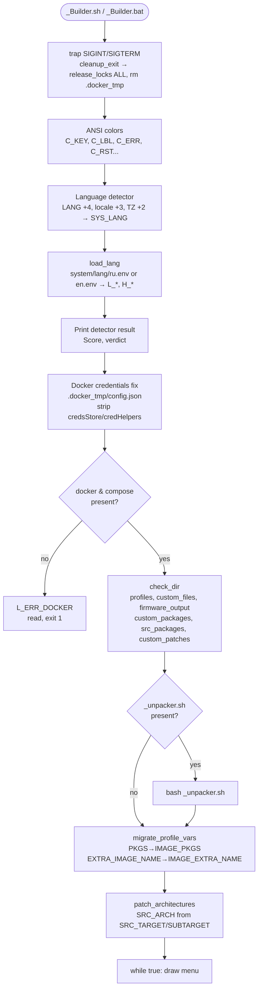
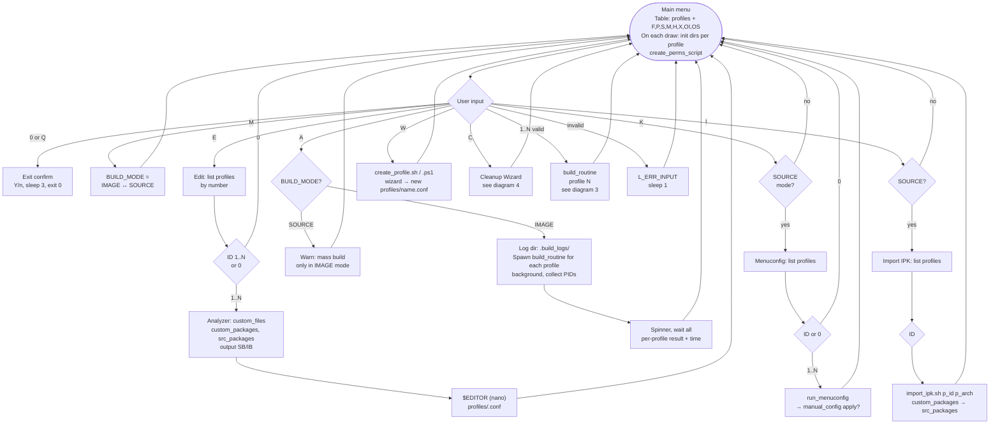
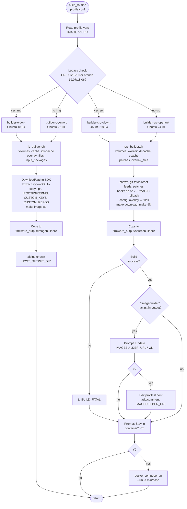
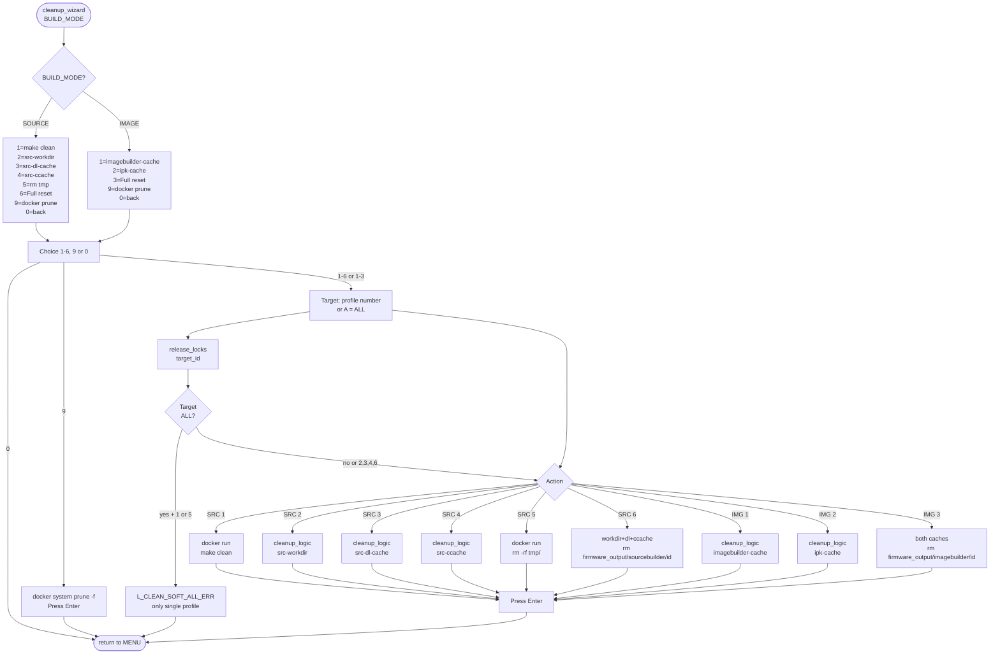
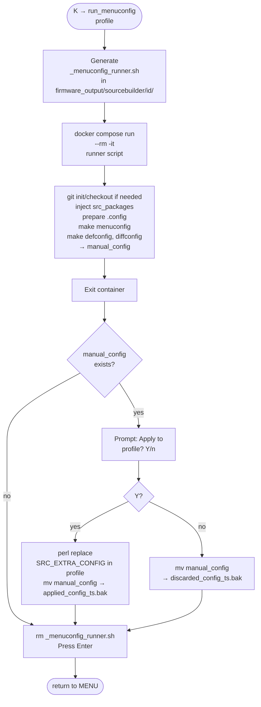
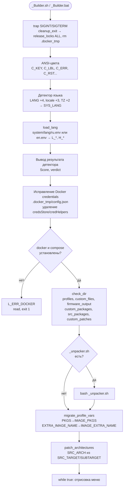
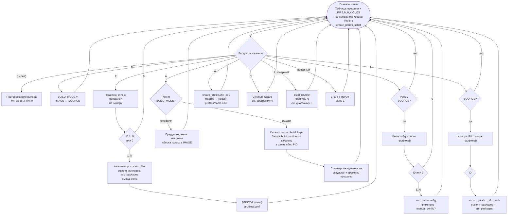
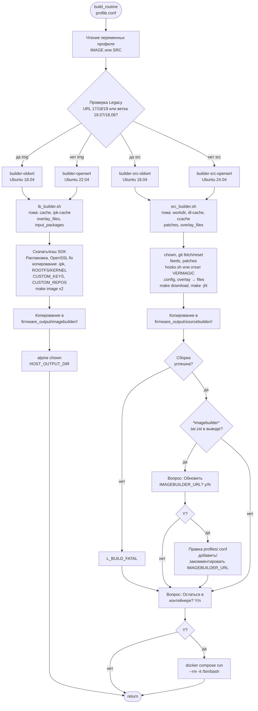
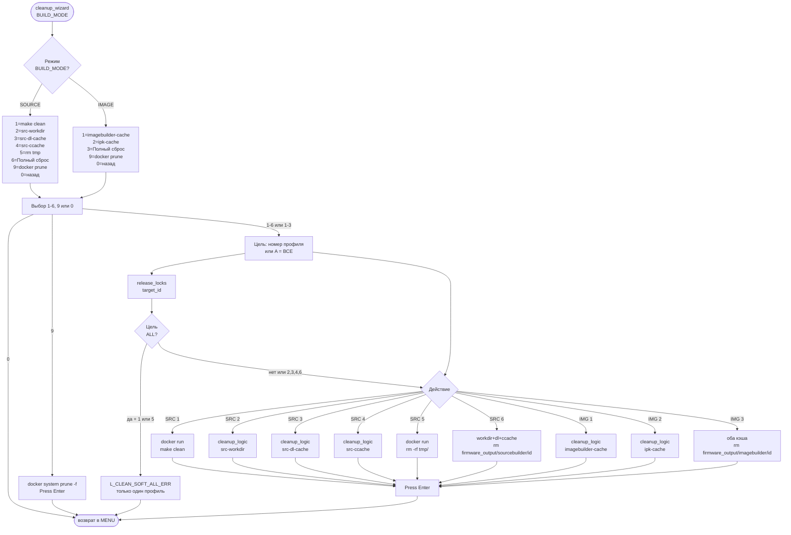
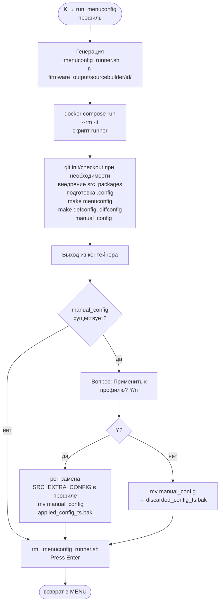

# routerFW — Process Diagrams / Диаграммы процессов

> Version: 4.43. Full diagram set. See [ARCHITECTURE_STUDY_PLAN.md](ARCHITECTURE_STUDY_PLAN.md) for coverage checklist.
>
> EN → [ARCHITECTURE_en.md](ARCHITECTURE_en.md) · RU → [ARCHITECTURE_ru.md](ARCHITECTURE_ru.md)

---

## 1. Startup sequence (EN)

---

## 2. Main menu — all choices (EN)

---

## 3. Build routine + post-actions (EN)

---

## 4. Cleanup Wizard (EN)

---

## 5. Menuconfig flow (EN)

---

## 6. Startup sequence (RU)

---

## 7. Main menu — all choices (RU)

---

## 8. Build routine + post-actions (RU)

---

## 9. Cleanup Wizard (RU)

---

## 10. Menuconfig flow (RU)

---

## Legend (table on menu draw)

| Symbol | Meaning |
|--------|---------|
| F | custom_files/<id> non-empty |
| P | custom_packages/<id> non-empty |
| S | src_packages/<id> non-empty |
| M | manual_config exists (sourcebuilder/<id>) |
| H | hooks.sh in custom_files/<id> |
| X | custom_patches/<id> non-empty |
| OI | firmware_output/imagebuilder/<id> has files |
| OS | firmware_output/sourcebuilder/<id> has files |
