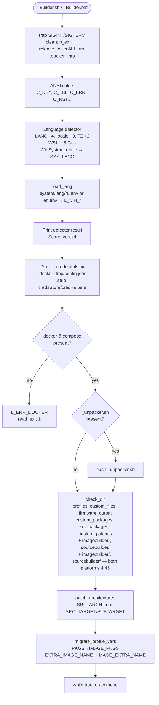
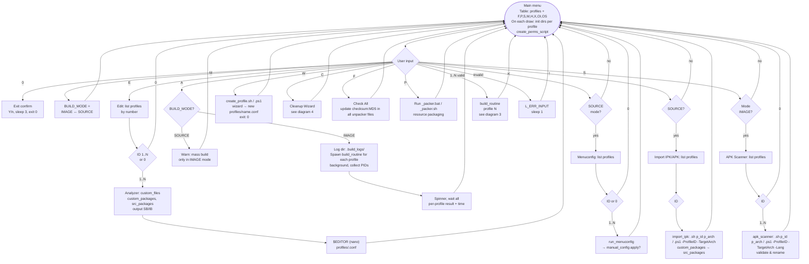
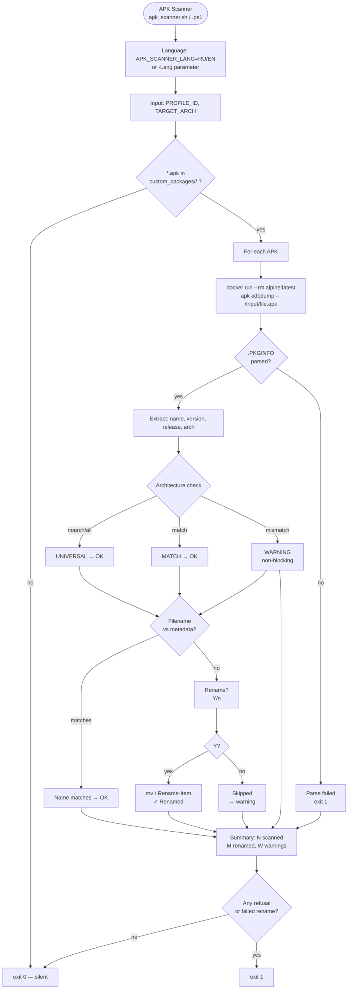
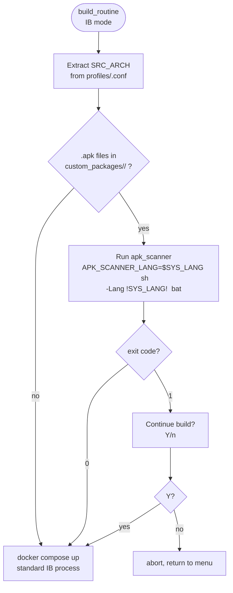
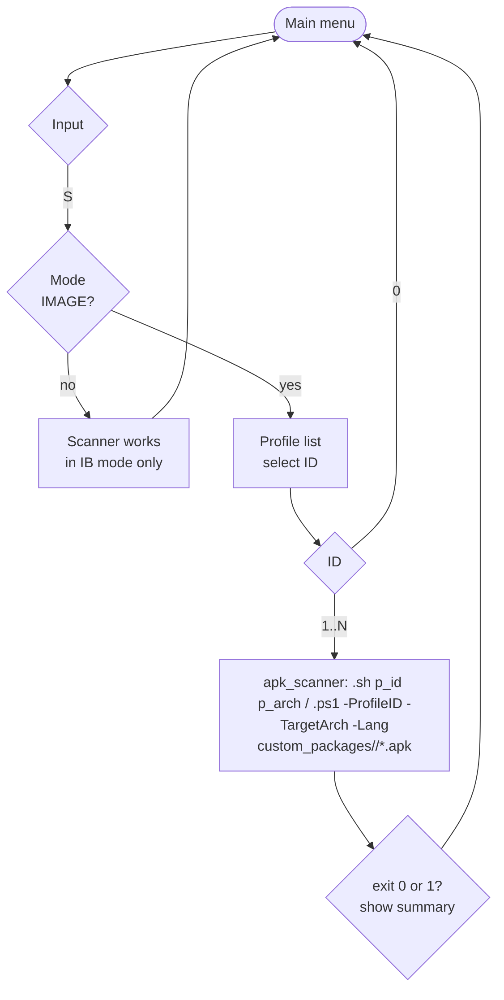
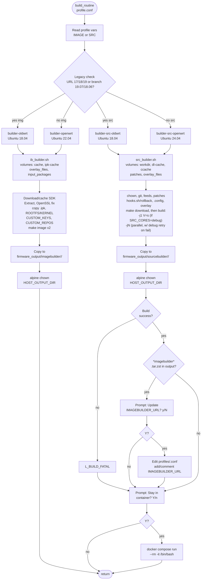
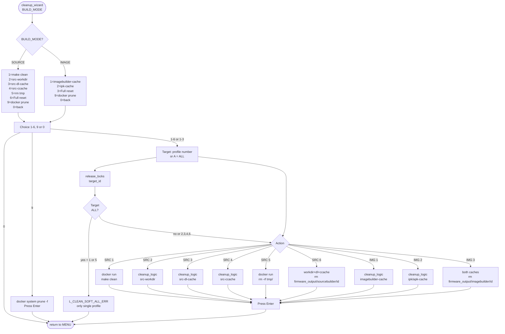
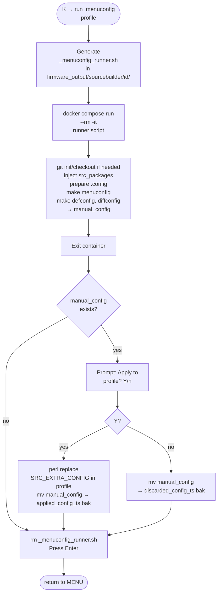

# file: docs/ARCHITECTURE_diagram_en.md

  <a href="ARCHITECTURE_diagram_ru.md"><b>🇷🇺 Русский</b></a> | <b>🇺🇸 English</b>

---

# routerFW — Process Diagrams

> Version: 4.60. English diagram set.
>
> Text: [ARCHITECTURE_en.md](ARCHITECTURE_en.md) · RU diagrams: [ARCHITECTURE_diagram_ru.md](ARCHITECTURE_diagram_ru.md)

---

## 1. Startup sequence (EN)

> **Platform:** This diagram reflects **Linux** (_Builder.sh). On Windows (_Builder.bat): no trap, no Docker credentials fix; unpack uses _unpacker.bat; patch_arch runs once at startup; migrate runs on **each** menu draw.

---

## 2. Main menu — all choices (EN)

### Command-line interface (Windows)

Running with arguments runs the chosen action without entering the interactive menu (after init and profile list build).

**Build mode (Image Builder / Source):**
- **Optional prefix before command:** `ib` or `image` = Image Builder, `src` or `source` = Source Builder. No prefix = **Image Builder** by default.
- **Build IB profile 1:** `_Builder.bat ib build 1` or `_Builder.bat build 1` (default is IB). On Linux use `./_Builder.sh` instead of `_Builder.bat`.
- **Build Source profile 1:** `_Builder.bat src build 1`.
- **Build all in chosen mode:** `_Builder.bat ib build-all`, `_Builder.bat src build-all`.
To choose mode in one command, use the `ib`/`src` prefix. Mode toggle (key **M** in the menu) is available only in the interactive menu.

**Interface language:** `--lang=RU` / `--lang=EN` or `-l RU` / `-l EN` (any position). No key = auto-detect.

| Command | Short | Arguments | Action |
|--------|--------|-----------|--------|
| `build` | `b` | \<id\> — number or profile name | Build one profile |
| `build-all` | `a`, `all` | — | Build all (mode: prefix ib/src or default IB) |
| `edit` | `e` | [id] | Profile editor (no id = interactive choice from list) |
| `menuconfig` | `k` | \<id\> | Menuconfig (SOURCE only) |
| `import` | `i` | \<id\> | Import IPK/APK (SOURCE only, APK support since v4.50) |
| `wizard` | `w` | — | Profile creation wizard |
| `clean` | `c` | [type] [target] | Clean: type 1–6 (SRC) or 1–3 (IMG), 9=prune; target = number or A |
| `state` | `s` | — | Profile table with flags (F,P,S,M,H,X,OI,OS) |
| `check` | — | `<id>` | Add/update checksum in profiles/ID.conf |
| `check-all` | — | — | Add/update checksum:MD5 in all unpacker files |
| `check-clear` | — | `[<id>]` | Clear checksum:MD5 from all files or one profile |
| `help` | `-h`, `--help` | — | Help and exit |

**Positional:** `_Builder.bat 2` is treated as `build 2` (default mode — IB). Commands are case-insensitive.

**Examples:** `_Builder.bat build 1`, `_Builder.bat ib build 1`, `_Builder.bat src build 1`, `_Builder.bat ib build-all`, `_Builder.bat clean 2 3`, `_Builder.bat check 1`, `_Builder.bat check-all`, `_Builder.bat edit myrouter`, `_Builder.bat --help`

**CLI test harnesses:** `tester.bat` / `tester.sh` run builders with args and check exit codes/output; safe checks only (no builds, clean, or menuconfig). Logs in `.gitignore`.

---

## 2.5. APK Scanner — Validation & Renaming (EN)

### Scanner integration into build_routine (IB mode)

### [S] button in the main menu

---

## 3. Build routine + post-actions (EN)

---

## 4. Cleanup Wizard (EN)

---

## 5. Menuconfig flow (EN)

---

## Legend (table on menu draw)

| Symbol | Meaning |
|--------|---------|
| F | custom_files/<id> non-empty |
| P | custom_packages/<id> non-empty |
| S | src_packages/<id> non-empty |
| M | manual_config exists (sourcebuilder/<id>) |
| H | hooks.sh in custom_files/<id> |
| X | custom_patches/<id> non-empty |
| OI | firmware_output/imagebuilder/<id> has files |
| OS | firmware_output/sourcebuilder/<id> has files |
