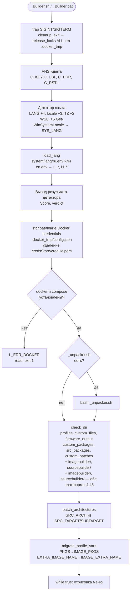
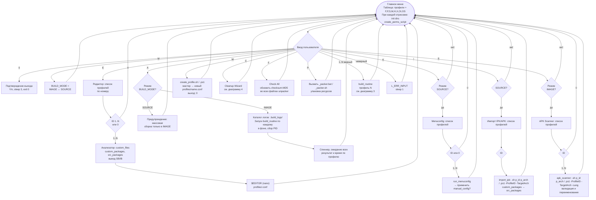
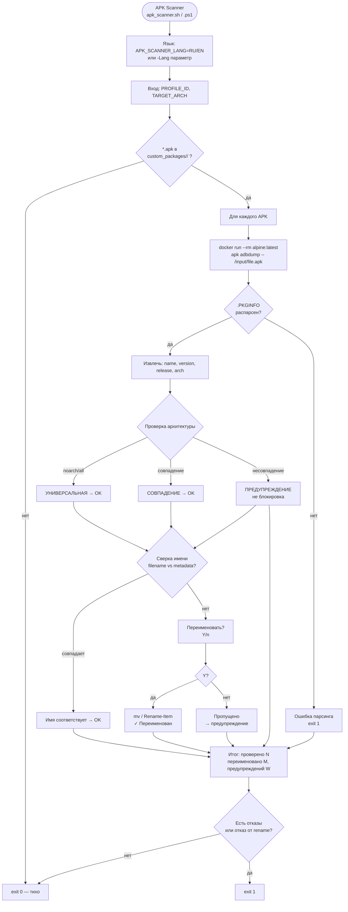
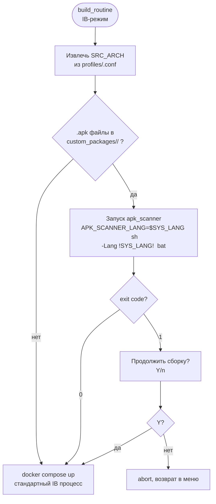
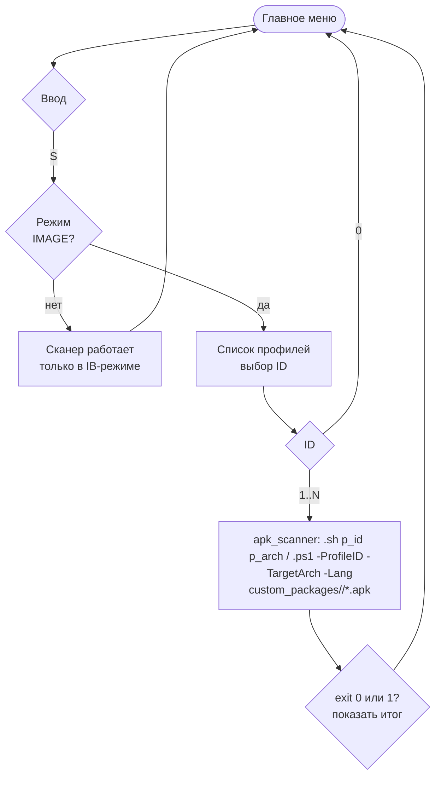
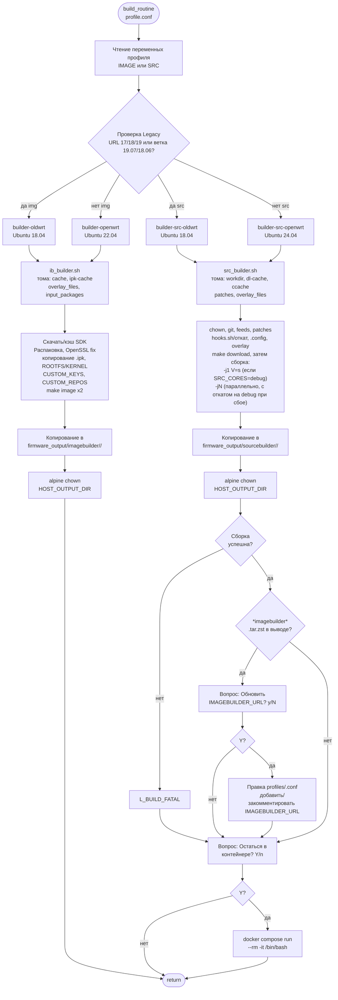
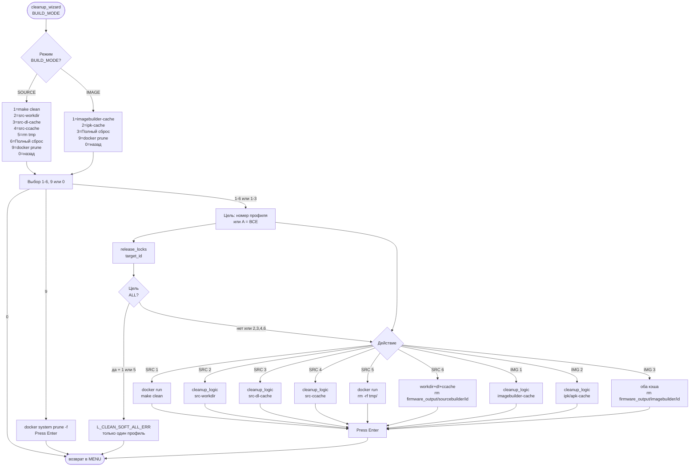
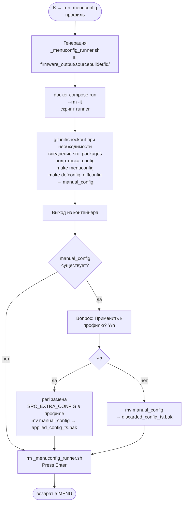

# file: docs/ARCHITECTURE_diagram_ru.md

  <b>🇷🇺 Русский</b> | <a href="ARCHITECTURE_diagram_en.md"><b>🇺🇸 English</b></a>

---

# routerFW — Диаграммы процессов

> Версия 4.60. Набор диаграмм (русская страница).
>
> Текст: [ARCHITECTURE_ru.md](ARCHITECTURE_ru.md) · EN diagrams: [ARCHITECTURE_diagram_en.md](ARCHITECTURE_diagram_en.md)

---

## 1. Стартовая последовательность (RU)

> **Платформа:** диаграмма отражает **Linux** (_Builder.sh). В Windows (_Builder.bat): нет trap и фикса Docker credentials; распаковка — _unpacker.bat; patch_arch один раз при старте; migrate выполняется при **каждой** отрисовке меню.

---

## 2. Главное меню — все варианты (RU)

### Управление из командной строки (Windows)

Запуск с аргументами выполняет действие без входа в интерактивное меню (после инициализации и построения списка профилей). На Linux те же команды и примеры применимы с заменой `_Builder.bat` на `./_Builder.sh`.

**Режим сборки (Image Builder / Source):**
- **Префикс перед командой** (опционально): `ib` или `image` — Image Builder, `src` или `source` — Source Builder. Без префикса используется **Image Builder** по умолчанию.
- **Собрать IB профиль 1:** `_Builder.bat ib build 1` или `_Builder.bat build 1` (по умолчанию IB).
- **Собрать Source профиль 1:** `_Builder.bat src build 1`.
- **Массовая сборка в нужном режиме:** `_Builder.bat ib build-all`, `_Builder.bat src build-all`.
Для явного выбора режима в одной команде используйте префикс `ib`/`src`. Переключение режима (клавиша **M** в меню) — только в интерактивном режиме.

| Команда | Краткий ключ | Аргументы | Действие |
|--------|--------------|-----------|----------|
| `build` | `b` | \<id\> — номер или имя профиля | Сборка одного профиля |
| `build-all` | `a`, `all` | — | Массовая сборка (режим: префикс ib/src или по умолчанию IB) |
| `edit` | `e` | [id] | Редактор профиля (без id — интерактивный выбор по списку) |
| `menuconfig` | `k` | \<id\> | Menuconfig (только SOURCE) |
| `import` | `i` | \<id\> | Импорт IPK/APK (только SOURCE, поддержка APK с v4.50) |
| `wizard` | `w` | — | Мастер создания профиля |
| `clean` | `c` | [тип] [цель] | Очистка: тип 1–6 (SRC) или 1–3 (IMG), 9=prune; цель — номер или A |
| `state` | `s` | — | Таблица профилей с флагами (F,P,S,M,H,X,OI,OS) |
| `check` | — | `<id>` | Добавить/обновить checksum в profiles/ID.conf |
| `check-all` | — | — | Добавить/обновить checksum:MD5 во все файлы из unpacker |
| `check-clear` | — | `[<id>]` | Очистить checksum:MD5 из всех файлов или одного профиля |
| `help` | `-h`, `--help` | — | Справка по ключам и выход |

**Язык интерфейса:** `--lang=RU` / `--lang=EN` или `-l RU` / `-l EN` (в любой позиции). Без ключа — автоопределение по системе.

**Позиционный вызов:** `_Builder.bat 2` трактуется как `build 2` (режим по умолчанию — IB). Регистр команд не учитывается.

**Примеры:** `_Builder.bat build 1`, `_Builder.bat --lang=EN build 1`, `_Builder.bat ib build 1`, `_Builder.bat src build-all`, `_Builder.bat clean 2 3`, `_Builder.bat check 1`, `_Builder.bat check-all`, `_Builder.bat --help`

**Тестовые оболочки CLI:** `tester.bat` / `tester.sh` запускают билдеры с аргументами и проверяют коды выхода и вывод; только безопасные проверки (без сборок, очистки и menuconfig). Логи в `.gitignore`.

---

## 2.5. APK Scanner — валидация и переименование (RU)

### Интеграция сканера в build_routine (IB-режим)

### Место кнопки [S] в главном меню

---

## 3. Сборка и пост-действия (RU)

---

## 4. Cleanup Wizard (RU)

---

## 5. Поток Menuconfig (RU)

---

## Легенда (таблица при отрисовке меню)

| Symbol | Meaning |
|--------|---------|
| F | custom_files/<id> non-empty |
| P | custom_packages/<id> non-empty |
| S | src_packages/<id> non-empty |
| M | manual_config exists (sourcebuilder/<id>) |
| H | hooks.sh in custom_files/<id> |
| X | custom_patches/<id> non-empty |
| OI | firmware_output/imagebuilder/<id> has files |
| OS | firmware_output/sourcebuilder/<id> has files |
