# file: docs\index.en.md

  <a href="index.md"><b>🇷🇺 Русский</b></a> | <b>🇺🇸 English</b>

---

# Universal OpenWrt Builder Tutorials

This is a series of lessons designed to help you master the Universal Builder, from the basics to advanced techniques.

## Table of Contents

1.  [**Lesson 1: Introduction to the Builder**](./01-introduction.en.md)
    *   *What is this tool, what problems does it solve, and what are its key advantages.*

2.  [**Lesson 2: Cemented Backup of Your Settings**](./02-digital-twin.en.md)
    *   *A practical guide to creating a firmware "clone" of your router, including all packages and settings.*

3.  [**Lesson 3: Building from Source: Maximum Control**](./03-source-build.en.md)
    *   *Mastering the `Source Builder` mode using a real-world example: utilizing `defconfig` and `menuconfig` for complex builds.*

4.  [**Lesson 4: Advanced Source Mode: Patches, Hacks, and Custom Packages**](./04-adv-source-build.en.md)
    *   *Working with `vermagic`, applying patches, adding third-party programs from source, and managing feeds.*

5.  [**Lesson 5: Advanced: Source Code Patching System**](./05-patch-sys.en.md)
    *   *Customizing builds by directly modifying OpenWrt source code using the "mirror overlay" system.*

6.  [**Lesson 6: Flashing RAX3000M eMMC**](./06-rax3000m-emmc-flash.en.md)
    *   *Manual GPT layout, bootenv, partition writing over SSH, overlay and U-Boot troubleshooting.*

7.  [**Troubleshooting and FAQ**](./07-troubleshooting-faq.en.md)
    *   *Build limitations (zapret/nfqws), device tips, links to related lessons.*

## Project Architecture

<picture>
  <source media="(prefers-color-scheme: dark)" srcset="../dist/architecture-tetris-dark.svg">
  <source media="(prefers-color-scheme: light)" srcset="../dist/architecture-tetris.svg">
  
</picture>

*   [**Architecture & Process Flow (EN)**](./ARCHITECTURE_en.md) — text diagrams of all build stages.
*   [**Архитектура и поток процессов (RU)**](./ARCHITECTURE_ru.md) — Russian version.
*   [**Mermaid Diagrams**](./ARCHITECTURE_diagram_en.md) — full interactive flowcharts: startup, menu, build, cleanup, menuconfig.

---

Project audit https://github.com/iqubik/routerFW/blob/main/docs/audit.md