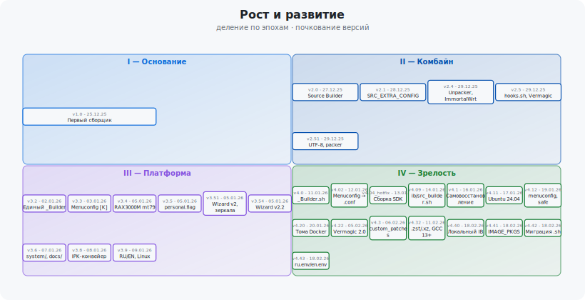

# file: docs\map.md
# Карта развития проекта routerFW

Составлено по CHANGELOG.md (теги релизов). Дата выгрузки CHANGELOG: 2026-02-20.

*Визуализация: четыре эпохи (I–IV), в каждой — ячейки релизов с ключевыми фичами и датами. Генерируется скриптом `system/architecture-tetris.ps1`.*

---

## 1. Временная шкала (по мажорным версиям)

| Эпоха   | Версии      | Период        | Суть этапа |
|--------|-------------|---------------|------------|
| **I**  | 1.0         | 2025-12-25    | Первый полноценный сборщик (Image Builder) |
| **II** | 2.0 – 2.51  | 2025-12-27 – 29 | Source Builder, универсальные профили, хуки, Vermagic, распаковщик |
| **III**| 3.2 – 3.9   | 2026-01-02 – 09 | Единый _Builder, мастера, IPK-конвейер, RU/EN, изоляция system/ |
| **IV** | 4.0 – 4.43  | 2026-01-11 – 02-18 | Linux (Bash), локализация, патчи, локальный IB, миграция переменных, единые словари |

---

## 2. Фазы развития (эпохи)

### Эпоха I — Основание (1.0)
- Запуск Image Builder для быстрой кастомизации готовых образов OpenWrt.
- Один режим сборки, один платформенный скрипт.

### Эпоха II — Универсальный комбайн (2.0 – 2.51)
- **2.0:** Source Builder (Legacy 18.04 / Modern 22.04), Persistence Cache, универсальные `.conf` (IB + Source), зеркала GitHub, раздельные папки вывода.
- **2.1:** `SRC_EXTRA_CONFIG`, поддержка форков (ImmortalWrt), вынос ресурсов в `_unpacker.bat`.
- **2.4:** Тонкая настройка через `SRC_EXTRA_CONFIG`, профиль RAX3000M ImmortalWrt, модульный распаковщик, Packer v1.5.
- **2.5:** Smart Hooks (`hooks.sh`), Vermagic Hack, умная очистка кэша.
- **2.51:** UTF-8 в packer/unpacker, исправление попадания hooks в IB, рефакторинг docker-compose.

### Эпоха III — Платформа и юзабилити (3.2 – 3.9)
- **3.2:** Единый `_Builder.bat` (IMAGE/SOURCE в одном меню), параллельная сборка `[A]`, отказ от вложенных скобок CMD; мастер профилей; Clean Menu `[C]`; атомарная загрузка SDK, wget/opkg retry; CCache, Self-Healing в Source; hooks.sh Vermagic v1.3.1, ImmortalWrt.
- **3.3:** Menuconfig `[K]`, ручной конфиг `manual_config`, Smart Init; сбор артефактов при смене subtarget; CRLF/права в Docker.
- **3.4:** Сборки mt79/RAX3000M eMMC (китайский Wi‑Fi), контроль ядер `SRC_CORES`, фикс Profile Wizard (BOM).
- **3.5:** Защита данных — `personal.flag`, исключение profiles/scripts/firmware_output из сброса; автоимпорт DEFAULT_PACKAGES в мастере.
- **3.51:** Profile Wizard v2 — ImmortalWrt, зеркала (KyaruCloud), навигация Z/Q, State Machine.
- **3.54:** Wizard v2.2 — умный ввод, автоименование, защита от перезаписи.
- **3.6:** Рефакторинг — всё системное в `system/`; docs/ (index, 01–04); README рерайт.
- **3.8:** IPK-конвейер — обёртка бинарных пакетов, sandbox по профилю, проверка архитектуры, Binary Integrity (Windows), мониторинг папок профиля.
- **3.9:** RU/EN (взвешенная детекция языка), локализация _Builder.bat и мастеров; WIFI EN patch; Linux Alpha.

### Эпоха IV — Кроссплатформенность и зрелость (4.0 – 4.43)
- **4.0:** Порт на Bash — `_Builder.sh`, `_packer.sh`, `_unpacker.sh`; дорожная карта 1–6 (включая двуязычность).
- **4.02:** Синхронизация bat/sh; перенос настроек из Menuconfig в `.conf`; индикатор M (Manual Config); Unpacker на EN; timestamp для backup конфигов.
- **4.04_hotfix:** Индикаторы H/M, поиск любых артефактов; фикс «вечного ожидания» загрузки; авто SRC_EXTRA_CONFIG в мастере; UTF-8 без BOM; NanoPi R3S.
- **4.09:** Оркестраторы `ib_builder.sh` / `src_builder.sh`; шаблоны профилей; docs/audit.md, LICENSE.en; ретраи wget/git; фикс credsStore, CRLF; определение успеха по артефактам.
- **4.1:** Самовосстановление, улучшенный парсинг конфигов; hooks.sh (умная очистка, авто Wi‑Fi); стабильность WSL.
- **4.11:** HOTFIX GCC (seccomp) на Ubuntu 24.04/WSL2; Legacy 18.04 → old-releases; git dubious ownership; формат SRC_EXTRA_CONFIG в мастере.
- **4.12:** Переработка сохранения menuconfig (bat/sh); полные SRC_EXTRA_CONFIG в профилях; снятие seccomp; Legacy Dockerfile на официальные репы; обновление packer-профилей.
- **4.20:** Фикс блокировки Docker-томов (остановка контейнеров перед удалением); паритет bat/sh; chown артефактов, абсолютные пути в WSL; цветовой вывод, время в [A], сводка перед [E]; menuconfig с дефисами в имени устройства; import_ipk libopenssl1.1→libopenssl; Ctrl+C.
- **4.22:** RAX3000M eMMC — один таргет cmcc_rax3000m-emmc-mtk; CONFIG_VERSIONOPT, метаданные; пакеты дисков/модемов; Vermagic Hack 2.0, зеркала для хэша; «Stay in Container».
- **4.3:** Система патчей `custom_patches/<profile>` (зеркальный оверлей), индикатор X; docs 05-patch-sys (RU/EN).
- **4.31:** (нет релиз-нот в CHANGELOG)
- **4.32:** custom_patches и HOST_PATCHES_DIR в .sh; Stay in Container; Clean Package Index; Smart Device Detection; Image Builder — .zst/.xz, фикс URL/query; CUSTOM_REPOS; libxcrypt/GCC 13+ в hooks.sh; Git LFS; обновление rax3000m_emmc.
- **4.40:** Локальный Image Builder в профиле (путь к архиву); автообновление профиля после Source-сборки (предложение подставить IB); быстрый повторный menuconfig; правильные ссылки на репозитории в create_profile (ARCH); список собранных файлов после сборки; фикс распаковки, репозиториев и патчей.
- **4.41:** Переименование PKGS→IMAGE_PKGS, EXTRA_IMAGE_NAME→IMAGE_EXTRA_NAME; автомиграция профилей в _Builder.bat; обратная совместимость в ib_builder.sh; шаблон и документация.
- **4.42:** migrate_profile_vars() в _Builder.sh; регистронезависимый ввод меню; Enter=Yes при выходе; Docker Credentials Fix (копирование config без credsStore); полная локализация _Builder.sh (L_*), 40+ ключей; create_profile.sh IMAGE_*, fantastic-packages/$ARCH; UTF-8 BOM в create_profile.ps1; .dockerignore (firmware_output и др.); .gitattributes; docker compose up в .sh; зеркала ImmortalWrt в hooks и мастерах; tr -d '\r' для профиля.
- **4.43:** Единые словари ru.env/en.env с плейсхолдерами {C_*}; загрузчики в bat/sh; конвенция file-header.mdc; hooks.sh v1.7 — цепочка зеркал vermagic, ветка openwrt-24.10-6.6 только kmods; create_profile 4 источника IB для ImmortalWrt.

---

## 3. Ключевые направления (темы)

| Тема | Версии | Кратко |
|------|--------|--------|
| **Два режима сборки** | 2.0 → | Image Builder + Source Builder, один .conf |
| **Кэш и скорость** | 2.0, 3.2, 4.09 | Persistence Cache, CCache, Self-Healing, retry wget/git |
| **Vermagic** | 2.5, 3.2, 4.22, 4.32, 4.43 | Подмена хэша ядра, зеркала, ветка 6.6 |
| **Хуки и патчи** | 2.5, 3.2, 4.3, 4.32 | hooks.sh, custom_patches, dos2unix |
| **Профили и мастера** | 2.0, 3.2, 3.5–3.54, 4.02–4.43 | create_profile, SRC_EXTRA_CONFIG, ImmortalWrt, миграция IMAGE_* |
| **IPK и пакеты** | 3.8, 3.9, 4.20 | Оборачивание .ipk, sandbox по профилю, libopenssl |
| **Единый лаунчер** | 3.2, 4.0 | _Builder.bat → _Builder.sh, меню M/E/A/C/K |
| **Локализация** | 3.9, 4.42, 4.43 | RU/EN, L_* словари, ru.env/en.env, {C_*} |
| **Docker и ОС** | 2.0–4.43 | тома, блокировки, WSL, Ubuntu 18/22/24, seccomp, credsStore |
| **Структура репо** | 3.6, 4.09, 4.41, 4.42 | system/, docs/, .dockerignore, .gitattributes, миграция переменных |

---

## 4. Сводная таблица релизов

| Тег | Дата (published) | Ключевой фокус |
|-----|------------------|----------------|
| 1.0 | 2025-12-25 | Первый сборщик |
| 2.0 | 2025-12-27 | Source Builder, универсальные профили |
| 2.1 | 2025-12-28 | SRC_EXTRA_CONFIG, _unpacker |
| 2.4 | 2025-12-29 | Модульный unpacker, ImmortalWrt профиль |
| 2.5 | 2025-12-29 | hooks.sh, Vermagic Hack |
| 2.51 | 2025-12-29 | UTF-8, фиксы packer/unpacker |
| 3.2 | 2026-01-02 | Единый _Builder.bat, CCache, Self-Healing |
| 3.3 | 2026-01-03 | Menuconfig [K], manual_config |
| 3.4 | 2026-01-05 | RAX3000M eMMC mt79, SRC_CORES |
| 3.5 | 2026-01-05 | personal.flag, DEFAULT_PACKAGES |
| 3.51 | 2026-01-05 | Wizard v2, ImmortalWrt, зеркала |
| 3.54 | 2026-01-05 | Wizard v2.2, автоименование |
| 3.6 | 2026-01-07 | system/, docs/ |
| 3.8 | 2026-01-08 | IPK-конвейер, sandbox |
| 3.9 | 2026-01-09 | RU/EN, Linux Alpha |
| 4.0 | 2026-01-11 | _Builder.sh, кроссплатформенность |
| 4.02 | 2026-01-12 | Menuconfig → .conf, индикатор M |
| 4.04_hotfix | 2026-01-13 | Загрузка SDK, авто SRC_EXTRA_CONFIG |
| 4.09 | 2026-01-14 | ib_builder.sh, src_builder.sh |
| 4.1 | 2026-01-16 | Самовосстановление, парсинг конфигов |
| 4.11 | 2026-01-17 | Ubuntu 24.04, Legacy old-releases |
| 4.12 | 2026-01-19 | Сохранение menuconfig, безопасность |
| 4.20 | 2026-01-20 | Тома Docker, паритет bat/sh, WSL |
| 4.22 | 2026-02-05 | RAX3000M eMMC, Vermagic 2.0 |
| 4.3 | 2026-02-06 | custom_patches, индикатор X |
| 4.31 | — | (нет релиз-нот) |
| 4.32 | 2026-02-11 | .zst/.xz, GCC 13+, зеркала |
| 4.40 | 2026-02-18 | Локальный IB, автообновление профиля |
| 4.41 | 2026-02-18 | IMAGE_PKGS / IMAGE_EXTRA_NAME, миграция |
| 4.42 | 2026-02-18 | Миграция в .sh, локализация .sh, docker up |
| 4.43 | 2026-02-18 | ru.env/en.env, file-header, vermagic mirrors |

---

## 5. Текущее состояние (на момент 4.43)

- **Платформы:** Windows (.bat, PowerShell), Linux (.sh).
- **Режимы:** Image Builder (быстрая сборка), Source Builder (полная компиляция).
- **Языки:** Русский, английский (словари `system/lang/ru.env`, `en.env`).
- **Профили:** Универсальные `.conf` (IMAGE_*, SRC_*, общие); миграция PKGS/EXTRA_IMAGE_NAME при старте.
- **Кастомизация:** custom_files, custom_packages, src_packages, custom_patches, hooks.sh.
- **Форки:** OpenWrt, ImmortalWrt (в т.ч. ветки mt798x 6.6), несколько зеркал IB и vermagic.

Карта может обновляться при появлении новых тегов и записей в CHANGELOG.
